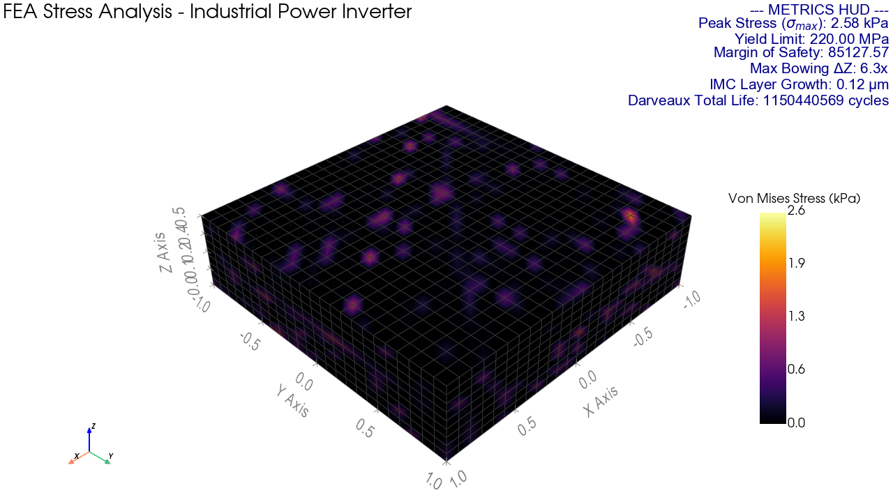
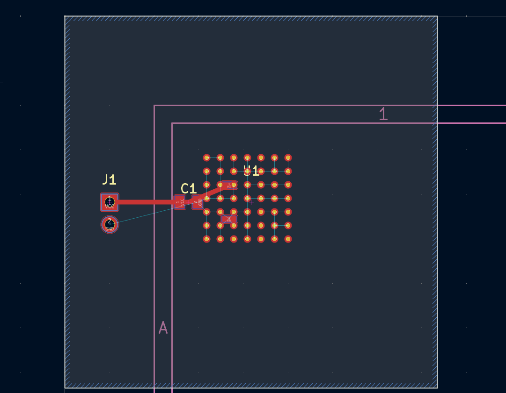

# Micro_dashboard: Multi-Physics PCB Thermal-Mechanical Optimization Pipeline

An automated, code-driven thermal-mechanical simulation and PCB generation framework. This pipeline co-optimizes thermal via arrays, pad geometry, trace clearances, and substrate relief gaps to minimize thermal cycling stress before exporting production-ready KiCad layouts and Gerber manufacturing packages.

---
## 1. Title, Introduction & Motivation

### Purpose & Relevance
Standard PCB CAD tools force manual, trial-and-error layout adjustments whenever thermal or mechanical constraints shift. In power electronics, automotive control systems, and aerospace packaging, mismatch in Coefficients of Thermal Expansion (CTE) between silicon dies, copper planes, and FR4/ceramic substrates induces severe cyclic shear strain—leading to solder joint fatigue, trace delamination, and board warping.

**Micro_dashboard** solves this by establishing a programmatic, closed-loop multi-physics workflow:
1. **Parametric CAD Generation:** Code-driven layout synthesis using `CadQuery`, `Trimesh`, and `KLayout`.
2. **3D FEA Thermal-Mechanical Solver:** Automated mesh generation and stress evaluation using `PyVista`.
3. **Iterative Stress Mitigation:** Closed-loop algorithmic adjustments targeting peak Von Mises stress reduction.
4. **Automated Gerber Export:** Native `.kicad_pcb` layout compilation and headless manufacturing package export via `kicad-cli`.

---

## 2. Methodology & Directory Architecture

### Repository Directory Structure
```text
Micro_dashboard/
├── cad_engine/          # 3D CAD geometry & parametric via array generator
├── config/              # Application design rules & environment profiles (JSON)
├── materials/           # Thermal-mechanical material database (Copper, FR4, Silicon, Solder)
├── models/              # Structural definitions & layer stackup classes
├── physics/             # 3D FEA thermal stress solver & fatigue reliability models
├── training/            # Optimization iteration loops & dataset generators
├── assets/              # Visualizations, FEA renders, PCB screenshots, and videos
├── outputs/             # Generated KiCad layouts, STEP models, and Gerber packages
├── micro_dashboard.py   # Main pipeline orchestrator entry point
├── TECHNICAL_BRIEF.md   # Mathematical derivations & physical formulations
└── LICENSE              # MIT License
```

**Evaluated Thermal-Mechanical Metrics**

1. **Peak Von Mises Stress ($\sigma_{\max}$):** Equivalent structural stress induced by CTE mismatch during thermal cycling.

2. **Stress Mitigation Rate:** Percentage stress reduction achieved over 6 layout optimization iterations.

3. **Margin of Safety (MoS):** Yield reserve calculated against copper/substrate yield limit ($220\text{ MPa}$).

4. **Bowing Warpage ($\Delta Z$):** Maximum flexural z-axis deformation preventing solder joint lifting.

5. **Intermetallic Compound (IMC) Layer Growth:** Arrhenius solid-state diffusion thickness modeling after 1 year of operation.

6. **Fatigue Reliability Models:** Cycle life prediction via Norris-Landzberg (modified Coffin-Manson) and Darveaux strain energy density models.

## 3. Mission Profile Results & Media Showcase

### Multi-Domain Performance Matrix


| Mission Profile | Consumer | Industrial | Automotive | Aerospace | Defense |
| :--- | :---: | :---: | :---: | :---: | :---: |
| **Peak Stress($\sigma_{\max}$)** | 1.22 kPa | 2.58 kPa | 3.13 kPa | 4.90 kPa | 5.71 kPa |
| **Stress Mitigation Rate** | 62.9% | 62.9% | 62.9% | 62.9% | 62.9% |
| **Margin of Safety (MoS)** | 179,714.88 | 85,127.57 | 70,322.60 | 44,927.97 | 38,509.54 |
| **Bowing Warpage ($\Delta Z$)** | 5.0× | 6.3× | 7.7× | 12.0× | 14.0× |
| **Via Array Count** | 31 Vias | 42 Vias | 49 Vias | 82 Vias | 110 Vias |
| **Substrate Dimensions (mm)** | 40.75 × 40.75 | 41.75 × 41.75 | 50.00 × 50.00 | 50.00 × 50.00 | 50.00 × 50.00 |
| **Substrate Thickness** | 1.51 mm | 1.41 mm | 1.18 mm | 1.18 mm | 1.18 mm |
| **IMC Growth (1 Year)** | 0.041 µm | 0.123 µm | 0.040 µm | 0.147 µm | 0.159 µm |
| **Norris-Landzberg Life** | 1,681,692 cycles | 380,534 cycles | 672,426 cycles | 222,021 cycles | 268,909 cycles |

### Thermal Stress Analysis & 3D Assembly Renders

| 3D PCB FEA Thermal Strain Animation | KiCad 3D Board Layout Inspection |
| :---: | :---: |
| <video src="assets/3D_PCB_CAD_Assembly_Render_Automotive.gif" width="100%" controls></video> | <video src="assets/KiCad_3D_View_Automotive.gif" width="100%" controls></video> |

| PyVista 3D FEA Stress Heatmap | KiCad PCB Layout Editor |
| :---: | :---: |
|  |  |

## 4. How-To Guide
### Prerequisites & Dependencies
 - **Python:** Version 3.10 or higher
 - **KiCad:** Version 8.0, 9.0, or 10.0 (with `kicad-cli` installed)
 - **Required Libraries:** `cadquery`, `pyvista`, `trimesh`, `klayout`, `numpy`, `scipy`, `matplotlib`

### Installation
```bash
git clone https://github.com/altugrakay-commits/Micro_dashboard.git
cd Micro_dashboard
pip install -r requirements.txt
```

## 5. Interactive Terminal Mode
Launch the pipeline orchestrator without arguments to invoke the interactive mission selector:
```bash
python micro_dashboard.py
```
```bash
==================================================
MICRO-DASHBOARD: MISSION PROFILE SELECT
==================================================
[1] AUTOMOTIVE | Automotive Engine Bay (ΔT = 115.0 K)
[2] AEROSPACE  | Aerospace Avionics (ΔT = 180.0 K)
[3] DEFENSE    | Defense Missile Guidance (ΔT = 210.0 K)
[4] CONSUMER   | Consumer Mobile Device (ΔT = 45.0 K)
[5] INDUSTRIAL | Industrial Power Inverter (ΔT = 95.0 K)
[Q] QUIT
--------------------------------------------------
Select a mission profile (1-5 or Q):
```

### Non-Interactive CLI Flag Mode
Bypass the menu for headless or automated scripting pipelines by passing the `--preset` flag:
```bash
python micro_dashboard.py --preset industrial
```

### Expected Execution & Output Directory Contents
Upon successful completion, the script logs convergence metrics to the terminal console and populates the `outputs/` folder:
```text
outputs/
├── design_rules.json                 # Active mission parameters
├── pcb_industrial.kicad_pcb          # Native KiCad layout file
├── pcb_assembly_industrial.step      # Complete 3D STEP geometry
├── stress_reduction_industrial.png   # 6-iteration stress convergence plot
├── fea_stress_industrial.png         # High-res PyVista 3D stress heatmap
└── gerbers_pcb_industrial/           # Manufacturing Export Package
    ├── manifest.json                 # Verification manifest
    ├── pcb_industrial-F_Cu.gbr       # Front Copper Layer
    ├── pcb_industrial-B_Cu.gbr       # Bottom Copper Layer
    ├── pcb_industrial-F_Mask.gbr     # Front Solder Mask
    ├── pcb_industrial-B_Mask.gbr     # Bottom Solder Mask
    ├── pcb_industrial-F_Silks.gbr    # Front Silkscreen
    ├── pcb_industrial-Edge_Cuts.gbr  # Board Contour
    └── pcb_industrial.drl            # Drill File (NC Drill)
```